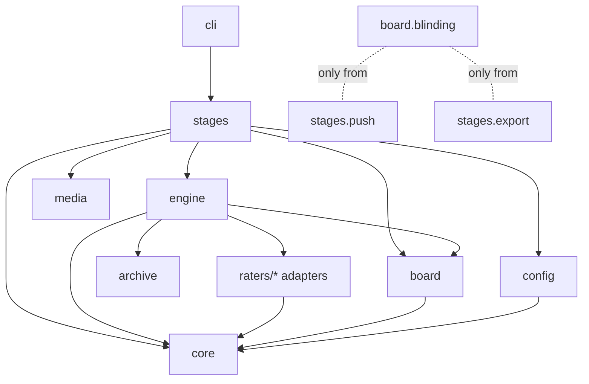
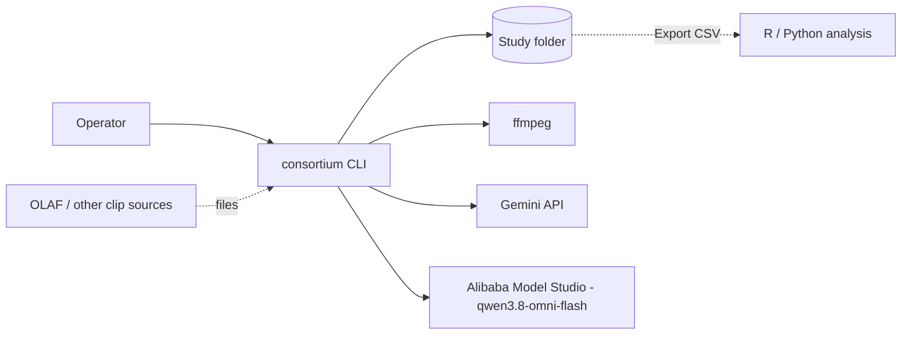
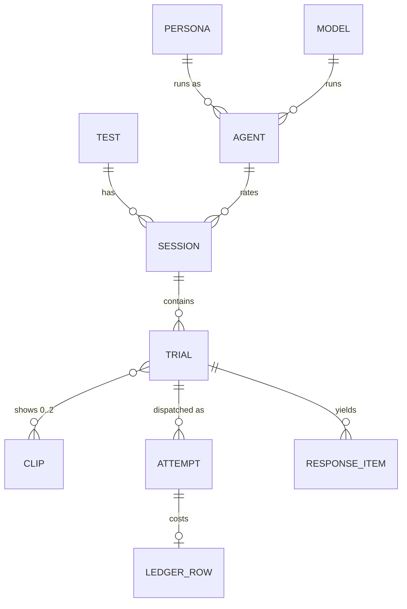

# Architecture Spine — Review Consortium

## Design Paradigm

**Hexagonal-lite with pipeline-stage use cases.**
- **Domain core** (`consortium/core/`): pure Python with no I/O. It holds the entities (Study, Panel, Agent, Test, Session, Trial) and the rules: lock contents, eligibility, exclusions, quotas, randomization, cost, prompt rendering and response validation.
- **Engine** (`consortium/engine/`): the one execution path for every Model call (AD-6).
- **Stages** (`consortium/stages/`): `init`, `personas`, `panel_copy`, `screen`, `push`, `freeze`, `open`, `status`, `export`. Each stage is a use case.
- **One port: `Rater`.** Its adapters are `fake`, `gemini` and `qwen`.
- **Infrastructure modules** (`board`, `media`, `config`, `archive`): plain modules, not ports.
- **The CLI** (`consortium/cli.py`) is a thin Typer layer over the stages.



## Invariants & Rules

### AD-1 — Dependency direction
- **Binds:** all
- **Prevents:** provider or storage code leaking into domain rules, and stages reaching into each other.
- **Rule:**
  - `core` imports only stdlib and pydantic.
  - Adapters import `core` only.
  - `engine` imports core, board, archive and raters.
  - Stages import core, engine and infrastructure, never another stage.
  - `cli` imports stages only.
  - These rules are enforced by import-linter contracts, run as a pytest test so they apply without CI.

### AD-2 — Blinding is an import boundary
- **Binds:** FR-11, FR-22, NFR-2
- **Prevents:** any code on the rating path from seeing Conditions.
- **Rule:**
  - Only `board/blinding.py` reads or writes `blinding_key.csv`.
  - Only `stages/push` and `stages/export` may import it. This is an import-linter forbidden contract.
  - Conditions never enter `board.db`, the Archive or any request.

### AD-3 — Single owner of mutable state
- **Binds:** FR-5, FR-7, FR-10, FR-12–FR-22, NFR-6
- **Prevents:** status, resume, eligibility, export and rater-flow counting different things, and SQLite write contention.
- **Rule:**
  - `board.db` (stdlib `sqlite3`, WAL mode) holds all mutable state for a Study, including screening results and the cost ceiling. Only `board/` executes SQL.
  - Inside a process, one writer task performs every write. Workers return results to it.
  - Across processes, a command that dispatches (`screen`, `open`, `open --resume`) holds an exclusive lease file, `board.lock`. A second dispatcher refuses to start. `status` and `export` only read.
  - Files in `panel/` and `tests/` are inputs. Once used, they are never rewritten in place.

### AD-4 — Trial lifecycle and attempts
- **Binds:** FR-9, FR-14–FR-22
- **Prevents:** stories inventing states, treating `sent` as "answered", or using duplicate attempt keys.
- **Rule:**
  - Trial states are `planned → sent → valid | invalid | refused | failed`. The last four are terminal and never change once reached.
  - `sent` means submitted. No code assumes an answer arrives synchronously.
  - Before every dispatch, including a retry or a resume, the writer increments `attempt`. Any `(trial_id, attempt)` is dispatched at most once.
  - A Trial stays `sent` across retries until it reaches a terminal state. If several attempts are valid, the highest one is the answer.
  - Resume collects every `sent` attempt that has a handle, and re-dispatches every `planned` Trial and every `sent` Trial that has none.

### AD-5 — Archive before state
- **Binds:** FR-24, NFR-3
- **Prevents:** the Archive missing a request or response that `board.db` records.
- **Rule:**
  - The rendered request is appended to `archive/requests.jsonl` before its attempt is marked `sent`.
  - The raw response is appended to `archive/responses.jsonl` before the Trial changes state.
  - Archive records are keyed by `(trial_id, attempt)`. They reference media by `clip_id` and its SHA-256, never by a provider file handle.
  - Archive files are append-only.

### AD-6 — One engine, and the Rater port
- **Binds:** FR-5, FR-8, FR-9, FR-10, FR-14–FR-18
- **Prevents:** a second runner for screening that skips the ledger or the Archive, a runner rewrite when batch modes arrive, and cost-ceiling overshoot.
- **Rule:**
  - Every Model call, including both Screenings, goes through `engine.dispatch(trials)`. Stages create Trials; only the engine sends them.
  - The `Rater` port has three operations:
    - `prepare(clip) -> media_ref`: upload once and reuse, re-preparing when a reference has expired.
    - `submit(requests) -> handles`
    - `collect(handles) -> results`
  - Real-time adapters ship first. Batch adapters come later behind the same port, with the mode chosen per Model in `study.yaml`.
  - Concurrency is capped per provider with an `asyncio.Semaphore`.

### AD-7 — Core renders, adapters transmit
- **Binds:** FR-5, FR-8, FR-15, FR-17, FR-24
- **Prevents:** prompts drifting per provider, and requests that can't be re-issued.
- **Rule:**
  - `core.render` builds a provider-neutral `TrialRequest` from the Persona card, Instrument, Prompt variant, Practice clips and zero, one or two Clip IDs. A screening questionnaire Trial has no Clip.
  - The request is fully determined by its inputs.
  - Adapters add only the pinned settings, and never change text.
  - Adapters return the raw response, usage, and the provider-reported model build when one exists.
  - Parsing and validation happen in `core`.
  - Persona photos are never an input to `core.render`.

### AD-8 — Protocol lock contents and hash
- **Binds:** FR-13, NFR-4
- **Prevents:** a file that affects data escaping the lock, or two hash schemes.
- **Rule:**
  - `protocol.lock` is a JSON map from relative path to SHA-256, plus a lock version and a combined hash. It covers:
    - `protocol.md`, `study.yaml`, `tests/*.yaml` and `prices.yaml`
    - every Instrument file in use, built-in ones included
    - `panel/` (Persona cards and the screening snapshot written at freeze)
    - the `consortium` package version
  - The cost ceiling is *not* locked (AD-9).
  - Hashes are SHA-256 over raw bytes, or over canonical JSON (sorted keys, UTF-8, no whitespace).
  - `open` and `open --resume` re-hash and refuse a main Test on any mismatch. Each Trial row stores its lock version.

### AD-9 — Config is read in one place
- **Binds:** FR-2, FR-3, FR-5, FR-10, FR-19
- **Prevents:** modules parsing YAML differently, thresholds hiding in code, and lock breaks for operational settings.
- **Rule:**
  - Only `config/` reads YAML (`yaml.safe_load` into Pydantic models).
  - Thresholds, defaults, the pinned `max_output_tokens` and Model settings live in `study.yaml`. Models are keyed by explicit `id:` values (`m1`, `m2`), never by list position.
  - The cost ceiling lives in `board.db`. It is set by `open --ceiling <usd>`, and every change is logged in the ledger and the manifest.

### AD-10 — Derived seeds
- **Binds:** FR-4, FR-16, FR-17
- **Prevents:** randomness that can't be reproduced, seed collisions, and seeds outside what providers accept.
- **Rule:**
  - There is one `study.seed`. Every other seed is `sha256("<study.seed>:<purpose>:<natural key>")`, with its first 8 hex digits taken as an int and then masked to 31 bits.
  - Natural keys are used, never autoincrement IDs. Examples: `personas`, `order:<session_id>`, `model:<session_id>:<trial_index>:<attempt>`.
  - Nothing uses unseeded randomness. The seeds used are stored on Trial rows.

### AD-11 — Clip ingest
- **Binds:** FR-11, FR-12
- **Prevents:** metadata or filename leaks, Clips in inconsistent formats, and Clips that a provider can't accept.
- **Rule:**
  - Every Clip passes through `media.canonicalize`: an ffmpeg re-encode to one profile, with all metadata stripped. It is stored as `clips/<clip_id>.mp4`, with an ID of `c_` plus 8 random base32 characters.
  - `push test` rejects a Test if any Trial's total media breaks a limit declared for one of its Models in `study.yaml`, such as duration or bytes.
  - Uploads use the Clip ID as the file name.

### AD-12 — Export and Rater-flow
- **Binds:** FR-16, FR-19, FR-20, FR-22
- **Prevents:** the Rater-flow report and Export disagreeing, and silent loss of rows.
- **Rule:**
  - Every Trial produces at least one Export row. A refused or failed Trial gets a row with its `status` set and an empty `response`.
  - A pairwise Trial carries `pair_id` and an ordered `clip_ids`. Its Export row has `clip_id_a`, `clip_id_b` and the Condition columns for each side.
  - Exclusions are computed only at export, by `core.exclusions`. Rows are flagged, never dropped.
  - The Rater-flow report takes steps 1–3 from the screening snapshot and steps 4–6 from the Export.
  - The Export schema has a version number. Pilot and screening Exports are separate files.

### AD-13 — One cost function
- **Binds:** FR-14, FR-18, NFR-5, NFR-9
- **Prevents:** the estimate and the ceiling using different math, double counting, and uploads before the operator confirms.
- **Rule:**
  - `core.cost(request)` estimates worst-case cost offline: media tokens from duration and frames via per-Model formulas in `prices.yaml`, plus the pinned `max_output_tokens`. No provider is called before confirmation.
  - The ledger has one row per `(trial_id, attempt)`, holding both reserved and actual cost. Committed spend is the sum of actual cost, or reserved cost where actual is not yet known.
  - The engine dispatches only while committed spend plus the next reservation stays within the ceiling.

### AD-14 — Qwen adapter: OpenAI-compatible and endpoint-agnostic
- **Binds:** FR-8, NFR-3, NFR-9
- **Prevents:** a rewrite when moving from hosted to self-hosted Qwen, and clips that exceed provider payload limits.
- **Rule:**
  - `raters/qwen.py` speaks only the OpenAI-compatible Chat Completions API. `base_url` and `model` come from `study.yaml`.
  - v1 targets hosted `qwen3.8-omni-flash` on Alibaba Model Studio (international region). A self-hosted vLLM serving open-weight Qwen3-Omni is a config change, not a code change.
  - Media goes inline as base64 `video_url` parts. Each Clip must fit the per-Model byte limit declared in `study.yaml` (AD-11).
  - The adapter archives the settings it sent and whether the provider documents them as honoured. Undocumented settings such as `temperature` and `seed` are flagged in the manifest.

## Consistency Conventions

| Concern | Convention |
| --- | --- |
| IDs | Clip `c_xxxxxxxx`. Persona `p<n>`. Model = its `study.yaml` `id`. Agent `p<n>-m<n>`. Test = the YAML's `test:` name. Session `<test>/<agent>/r<repeat>`. Trial: `session_id` + `trial_index` (natural key). Screening run `s<n>`. |
| Time | UTC ISO 8601 with `Z` everywhere. |
| Hashes | SHA-256, lowercase hex (AD-8). |
| Errors | One `ConsortiumError(code, message, path?)`. The CLI prints `code: message` and exits non-zero. Reason codes are snake_case and are reused in the Rater-flow report. |
| Output | Data goes to stdout; logs go to stderr through stdlib `logging`. No telemetry. |
| Secrets | API keys come only from environment variables (`GEMINI_API_KEY`, `DASHSCOPE_API_KEY`), never from Study files or the Archive. |
| Paths | Every command takes `--study <path>` (default: the current directory). Stored paths are relative to the Study folder. |
| Money | USD as a decimal string. |
| Screening | Results are stamped with the Model settings hash and the Instrument hash. `core.eligibility` decides who may rate, and `open` refuses if no current pass exists. Superseded runs are kept. `panel copy` imports Persona cards and stamped results. |

## Stack

| Name | Version |
| --- | --- |
| Python | >= 3.12 |
| uv (packaging, `uv tool install`) | 0.12 |
| Typer | 0.27 |
| Pydantic | 2.13 |
| PyYAML | 6.0 |
| sqlite3 (WAL) | stdlib |
| google-genai (`generate_content`, static processing mode) | 2.27 |
| openai (OpenAI-compatible: Model Studio / vLLM) | 3.23 |
| ffmpeg (system dependency) | >= 6 |
| pytest | 9.1 |
| ruff | 0.16 |
| import-linter | 2.15 |

## Structural Seed



Deployment: a local, single-user CLI with no server. The only outbound traffic goes to the configured providers, and `open` names them before any upload.

```text
consortium/
  cli.py
  core/        # entities, render, validate, cost, eligibility, exclusions, quotas (pure)
  engine/      # dispatch: ledger, archive, retries, semaphore, single writer
  stages/      # init personas panel_copy screen push freeze open status export
  raters/      # base.py (Rater port), fake.py, gemini.py, qwen.py
  board/       # db.py (schema, writer, lease), blinding.py
  archive/     # append-only JSONL
  media/       # ffmpeg canonicalize + leak metrics
  config/      # pydantic models, loaders
  instruments/ # built-in Instrument YAMLs
  templates/   # study init template, protocol.md template
docs/INTERFACE.md
tests/         # incl. import-linter contract test
```

```text
<study>/
  study.yaml  protocol.md  protocol.lock  prices.yaml
  tests/*.yaml
  panel/              # persona cards, screening snapshot (copyable)
  clips/<clip_id>.mp4
  blinding_key.csv
  board.db  board.lock
  archive/requests.jsonl  archive/responses.jsonl
  exports/
```



## Capability → Architecture Map

| Capability / Area | Lives in | Governed by |
| --- | --- | --- |
| Study setup, Instruments (FR-1–3) | `stages/init`, `config/`, `instruments/` | AD-9 |
| Personas, screening, Panel copy (FR-4, 5, 7, 10) | `core/`, `stages/personas`, `stages/screen`, `stages/panel_copy` | AD-3, AD-6, AD-7, AD-10, Screening convention |
| Persona photos (FR-6) | deferred | AD-7 (never rendered) |
| Model adapters, failures (FR-8, 9) | `raters/`, `engine/` | AD-4, AD-6, AD-7 |
| Push, Test, lock, open (FR-11–14) | `stages/push`, `stages/freeze`, `stages/open`, `media/` | AD-2, AD-8, AD-11, AD-13 |
| Runner (FR-15–18) | `engine/`, `core/render` | AD-3–AD-7, AD-10, AD-13 |
| Catch trials, Rater-flow (FR-19, 20) | `core/exclusions`, `stages/export` | AD-12 |
| Status, Export, Archive, manifest (FR-21, 22, 24) | `stages/status`, `stages/export`, `archive/` | AD-3, AD-5, AD-12 |
| Distribution, template, INTERFACE.md (FR-25–27) | repo root, `templates/`, `docs/` | Stack |

## Deferred

- **Batch adapters:** the port supports them (AD-6). Build when real-time cost becomes the bottleneck.
- **Persona photos with an image-generation adapter (FR-6), and the local status page (FR-23):** out of the MVP. Neither touches the rating path.
- **Exact SQLite table layout:** owned by `board/`. It is bound only by AD-3, AD-4 and AD-13.
- **The canonical ffmpeg profile and per-Model media limits:** set at Model onboarding (AD-11). Constraints:
  - Clips of 60–120 s must stay under the Qwen base64 limit (< 10 MB encoded, so about 7 MB raw). That means a low-bitrate profile (roughly 480p, ≤ 400 kbps).
  - Perception screening confirms the profile still lets the Models perceive the constructs.
  - Gemini needs static processing mode for a custom fps.
- **Self-hosting open-weight Qwen3-Omni (vLLM):** supported by AD-14 as a config change. Do it if a reviewer asks for weight-level reproducibility.
- **CI provider, PyPI publishing and license:** decided at release. Import rules already run in pytest.
- **Mapping GUIDE-LLM items to the manifest:** PRD Q2, decided in the FR-24 story.
